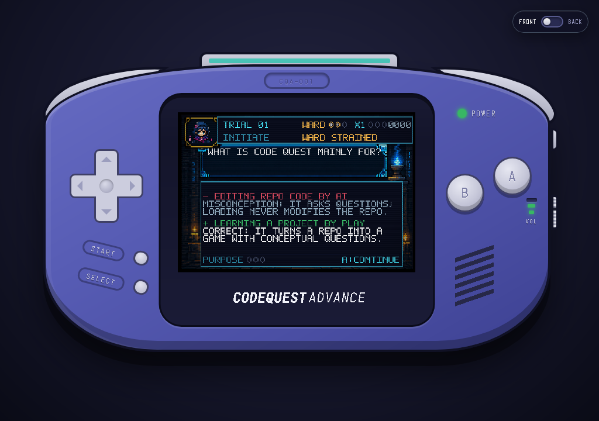
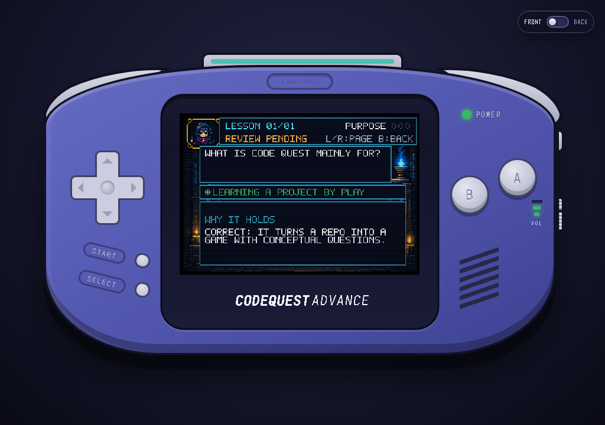

# CODE QUEST ADVANCE

Turn a local Git repository into a cartridge and learn it through a retro
handheld game. CODE QUEST ADVANCE inspects the repository on your machine,
generates conceptual questions with your selected local Codex or Claude CLI,
and runs the game in a native Tauri app backed by a headless Bevy engine.


| Oracle Datafall | Concept trial |
|---|---|
|  |  |

A live session against this repository, with questions generated by Claude:

| The lesson after a miss | The Codex remembers it |
|---|---|
|  |  |

## What is playable now

The repository's own [`CODEQUEST.toml`](CODEQUEST.toml) is the reference
cartridge. It defines a manifest-driven Oracle quiz with this complete loop:

1. Insert the repository while the console is off, then switch on the power.
2. Watch repository credits and a five-scene Oracle awakening while the first
   question batch is generated in the background.
3. Create a hero by choosing a name, path, and aura.
4. Play **Oracle Datafall** while the next valid question is loading: move left
   or right, collect data shards, and avoid corruption glyphs.
5. Answer conceptual questions about the project's purpose, responsibilities,
   interactions, invariants, and tradeoffs, then read the lesson card that
   explains the answer.
6. Survive a six-question batch to level up and deepen the next batch's
   concepts. Lose all three wards to end the run.
7. Open the **Oracle Codex** from the menu to see per-lens mastery and reread
   every lesson you have earned.

## How the game teaches

CODE QUEST is built to leave you with a durable model of the project, not a
score. Every question assesses one of five concept lenses: **purpose**,
**roles** (responsibilities), **flows** (interactions), **invariants**, and
**tradeoffs**.

- **Every choice explains itself.** Generated questions carry a short
  rationale for each choice. After you commit, a lesson card replaces the
  choices: a miss shows *why your pick was wrong* (the misconception it
  represents) and then why the answer holds; a success reinforces the
  reasoning. The card waits for you to press A.
- **Position never gives the answer away.** Language models put the correct
  answer first most of the time (11 of 12 in a live run against this
  repository), and the cursor starts on the first choice. Choices are shown in
  a stable per-question shuffle, and every retry moves every choice.
- **Misses come back.** A missed question returns after three other
  questions, in the next batch if needed, so the retry never comes straight
  after its lesson card. A correct retry in the same launch clears the pending
  review but counts as *relearning*, not mastery, because you just read the
  answer. Every miss returns once more in a later launch; answering it then is
  a *redemption* that earns mastery evidence and retires the question.
  First-try correct answers retire their questions for good.
- **Difficulty deepens the concepts, not the pressure.** Initiate batches
  (level 1) focus on purpose and roles, Adept batches (2–3) on flows and
  tradeoffs, and Oracle-bound batches (4+) on invariants, including **PREDICT**
  questions that describe an undocumented change or failure and ask what the
  design implies. There are no timers.
- **Mastery is visible.** Each lens has three mastery runes that wake at 1, 3,
  and 5 pieces of evidence (first-try successes plus later-launch
  redemptions). Rune II also needs 60% of your last five graded answers on the
  lens right (same-launch retry successes are not graded), and rune III needs
  80% and no pending review, so volume alone cannot
  hide a current misconception. A rune held back by those gates shows
  *cracked* (review due) instead of going dark. The Codex shows the runes with
  pending reviews, and pages through the lesson journal: question, answer, and
  rationale.
- **Generation adapts to you.** Each request names your weakest lens and the
  questions you have already been asked, so new batches target your gaps
  without repeating themselves.

The current progression model is visible as well as numeric:

- Correct-answer flow awards x1 at streaks 0–2, x2 at 3–5, and x3 at 6+.
- Cumulative scores of 300, 900, and 1800 awaken Insight Runes I, II, and III.
- Datafall charge lights at 3, 6, and 9 collected shards; corruption breaks
  containment seals at 1, 3, and 5 hits. These are expressive Datafall goals
  and do not alter quiz score, wards, or question generation.
- Oracle bond presentation advances from Initiate at level 1, to Adept at
  levels 2–3, to Oracle-bound at level 4 and above.

The game has no filler question deck. If the installed AI provider returns an
invalid batch, the Oracle keeps Datafall playable and retries; press B to leave
the wait safely.

Sound is engine-owned, like the framebuffer. Each tick the engine compares the
observable game state with the previous tick and emits tick-stamped notes for a
four-voice chip (two pulses, a triangle wave, and noise); the shell's speaker
only plays them. Scene loops stop on the tick their scene exits, one input
produces at most one cue, and the Datafall and level-up arrangements gain a
voice with each Oracle bond tier. The audio context starts on your first key
press or device press, and the right-edge volume wheel (or V) steps through
MUTE, LOW, MID, and HIGH; the setting is remembered. Every answer, threshold,
and status stays visible on screen when muted.

When your system asks for reduced motion, the engine freezes decorative motion
inside the framebuffer (blinking prompts stay lit, heroes stop bobbing,
starfields stop scrolling) without changing any scene timing, input, or data.

Screen readers get the game in words. Beside the framebuffer and the notes,
the engine writes a plain-language transcript of every screen: the question,
its choices in display order and which one is focused, the lesson card's
reasoning, the Codex pages, the Oracle's status, and the controls that work.
The shell places it in a visually hidden, polite live region. The engine
republishes the transcript only when its words change, so blinking prompts
and falling data are never announced. A new screen is read whole; a small
change on the same screen, such as focus moving to another choice, is read
on its own.

## Install

Download the current packages from the
[latest release](https://github.com/shpwrck/codequest/releases/latest).
Tagged packages can lag the source tree; the screenshots and feature
descriptions in this README track the current repository state.

| Platform | Package | Architecture |
|---|---|---|
| Linux | `.AppImage` | x86_64 |
| Windows | NSIS `.exe` or WiX `.msi` | x86_64 |
| macOS | `.dmg` or zipped `.app` | Universal (Apple Silicon + Intel) |

Linux AppImages are portable and need no installed toolchain:

```bash
chmod +x code-quest-advance_0.2.3_amd64.AppImage
./code-quest-advance_0.2.3_amd64.AppImage
```

If FUSE is unavailable, add `--appimage-extract-and-run`. The packaged AppImage
carries GTK3 and WebKitGTK 4.1 and is verified on RHEL 9 and Fedora 43; the host
still supplies its graphics stack and fonts.

The desktop package is only the game runtime. Its cartridges use local command
line tools:

- `git` is required for every cartridge.
- Either `codex` or `claude` is required for quiz question generation and must
  already be authenticated. The installed battery pack selects which one runs.
- `bash` is required for quest-battle commands. Git for Windows supplies the
  supported Windows shell; WSL Bash is deliberately ignored because it cannot
  consume the Windows repository paths used by the quest runner.

On Windows, standard Git for Windows, Codex, and Claude installation locations
are discovered automatically: `.exe` files on `PATH`, `%USERPROFILE%\.local\bin`,
the standalone Codex installer's `%LOCALAPPDATA%\Programs\OpenAI\Codex\bin`,
and npm global installs (`codex.cmd` or `claude.cmd` on `PATH` or in
`%APPDATA%\npm`). Prompts reach either CLI on stdin, so their size is not
limited by the command line. Custom or portable installs can set `CQA_GIT`,
`CQA_CODEX`, `CQA_CLAUDE`, and `CQA_SHELL` to an executable name on `PATH` or
an absolute path. macOS GUI launches repair their restricted `PATH` before tool
discovery.

## Load AI batteries

The console starts with no AI provider selected. Turn the device over with the
FRONT/BACK switch, press the battery door, and load one of the two-AA packs:

- **Codex:** blue cells using the Codex terminal mark.
- **Claude:** cream, coral, and charcoal cells.

Press the installed pair to remove it and expose the provider choices again.
Battery selection persists between launches, but readiness is proved again for
each application session. On the first power-on, CODE QUEST makes one minimal
non-interactive request to the selected CLI. The engine and boot animation do
not start until that request succeeds. If the pack is missing or the CLI is
unavailable, unauthenticated, or unhealthy, the switch and power LED flash red
and return to the off position. The reason the CLI reported, such as
`CODEX CLI UNAVAILABLE - ENTITY NOT FOUND` or the first line the CLI wrote to
stderr, appears in the device's status strip and stays on the
CHECK BATTERIES guide and the rear battery tab until power is tried again or
the batteries are changed.
Battery changes are locked while power is on.

## Load a cartridge

A cartridge is a **local Git repository**.

1. Leave the power off and click the top cartridge slot, or press C, to open
   the rack.
2. Choose **+ ADD FROM DISK** and select a repository with the native folder
   picker.
3. Drag the cartridge up to load it, or focus it and press Enter.
4. Close the rack and switch on the power, or press P.

The rack caches at most three repositories. Labels show the current branch and
refresh whenever the rack opens. Drag a cartridge down, press Delete, or use its
recycle action to remove only the rack entry; repository files and saves remain
on disk. A loaded cartridge must be ejected before another can be inserted.
If a cartridge fails to load, for example because its `CODEQUEST.toml` is
invalid or its drive is not mounted, the rack keeps it and shows the error; fix
the problem and load it again. Only a folder that is no longer a Git repository
leaves the rack on its own.

Loading a repository creates a versioned, namespaced save beside it, never
inside it: `/games/demo` uses `/games/demo.sav`. Quiz saves retain validated AI
question batches, retired (correctly answered) questions, questions awaiting
review, and per-lens mastery. Legacy saves, including Claude-era batches and
questions without rationales, load without conversion. Committing an answer
records it immediately on a background writer: a first-try correct answer
retires the question for later runs and launches, while a miss keeps it queued
for review until you redeem it in a later launch (a same-launch correct retry
queues it once more for that check). Ejecting or recycling a cartridge does not
delete its save.

Loading alone does not modify the selected repository. Quest mode can run the
repository's own lint, build, or test scripts, so those commands have whatever
side effects the project itself defines.

## Game modes

Cartridge selection follows this order:

| Repository contents | Mode |
|---|---|
| Valid `CODEQUEST.toml` | The manifest's `quiz` or `quest` game type |
| No manifest, but `CODEQUEST.md` exists | Legacy quest-battle mode |
| Neither file exists | Endless repository quiz |

### Quiz

Quiz cartridges request six questions from the verified battery provider. The
request carries an anonymized project brief: the README, design documents, the
manifest summary, and doc comments plus top-level signatures from up to 30
components spread across the tree, labelled `COMPONENT n` with every path and
file name withheld so questions stay conceptual.

Each generated question names its lens and gives four distinct choices, exactly
one correct answer, and a rationale for every choice. A question is accepted
only if it fits the display (four 31-character lines, 31 characters per choice,
three 34-character rationale lines), uses a known lens, and asks no repository
trivia: no file locations, counts, dates, versions, commits, branches, or
authors. Ordinary nouns such as "file" or "path" are fine in a conceptual
question. Valid questions survive a mixed batch; a short delivery is topped up
until the batch holds six. Accepted batches are cached in the sibling save and
prefetched while the player continues.

Set `CQA_CODEX_MODEL` or `CQA_CLAUDE_MODEL` to choose the model used by the
corresponding CLI. Set `CQA_NO_AI=1` to disable generation for diagnostics;
`0`, `false`, `no`, and `off` leave it enabled.

### Quest battle

Quest cartridges turn repository operations into streamed command battles.
Every repository receives:

- **Scrying Pool:** `git status --short --branch`
- **The Log Barrow:** a decorated 12-commit history
- **Diff Marsh:** working-tree and staged diff statistics

The engine also adds quests for `lint`, `build`, and `test` scripts in
`package.json`, `cargo check` when `Cargo.toml` exists, and a `make -n` dry run
when a `Makefile` exists. The Bevy runtime starts, streams, and aborts these
commands; B aborts an active battle.

### `CODEQUEST.toml`

`CODEQUEST.toml` is an optional, strict cartridge contract. Schema v2 selects a
trusted game family, a start scene, built-in scene handlers, semantic
transitions, and built-in visual templates. It can reorder and reuse supported
behavior, but it cannot load cartridge JavaScript, add arbitrary conditions,
execute custom commands, or replace the engine loop. Mechanics and template-less
art entries remain validated design metadata.

Schema v1 still loads as metadata and runs the matching built-in quiz or quest
flow. Invalid manifests, unknown keys, unresolved references, unreachable
scenes, and unsupported handler/signal combinations refuse the cartridge
instead of silently falling back.

- [`CODEQUEST.toml` v2 reference](docs/reference/codequest-toml.md)
- [Maintained complete example](docs/examples/CODEQUEST.toml)
- [Oracle quiz design and runtime traceability](docs/game-design/oracle-quiz.md)

## Controls

All physical controls are clickable. The floating FRONT/BACK switch turns the
whole unit over; the rear battery door selects the AI provider, the rear label
lists gameplay bindings, and the serial plate shows the short commit hash of
the running CODE QUEST ADVANCE build.

| Keyboard | Handheld input | Current use |
|---|---|---|
| Arrow keys | D-pad | Navigate; move during Datafall; page the Codex |
| D | A | Confirm, answer, continue past a lesson, or start a quest |
| S | B | Back, leave the Oracle or Codex, leave a run (press twice), or abort a quest |
| Enter | START | Start or confirm |
| Shift | SELECT | Reserved |
| A / F | L / R | Page the quest list or the Codex |
| P | Power switch | Turn the device on or off |
| C | Cartridge slot | Open or close the rack while powered off |
| F1 | FRONT/BACK switch | Turn the device over |
| V | Volume wheel | Cycle MUTE, LOW, MID, HIGH |

The engine consumes input edges, not browser key-repeat events. During the
Datafall-to-question handoff and the 45-tick lesson hold, inactive controls are
explicitly ignored so a held key cannot answer the next question accidentally.
After the hold, the lesson card waits for a fresh A or Start press, and leaving
an active question takes two B presses within 90 ticks.

## Architecture

Gameplay and device presentation have a hard boundary:

| Path | Responsibility |
|---|---|
| `src/` | JavaScript/CSS physical shell, cartridge rack, native-dialog bridge, boot overlay, input forwarding, window fitting, framebuffer canvas, device status strip, and the WebAudio speaker (`speaker.js`) that plays engine notes |
| `src-tauri/src/engine.rs` | Headless Bevy game state, fixed-step timing, input edges, Oracle/quiz/Codex/quest behavior, lesson cards and spaced retry, command effects, and CPU rendering |
| `src-tauri/src/engine/transcript.rs` | The screen transcript for screen readers, derived from the same state and helpers the renderers use, and its change-only publication |
| `src-tauri/src/audio.rs` | Engine-owned four-voice chip sound: per-tick state snapshots, the cue/loop director, and tick-stamped notes |
| `src-tauri/src/learning.rs` | The learning model: concept lenses, answer evidence, mastery thresholds, the lesson journal, and choice-presentation order |
| `src-tauri/src/scene_machine.rs` | Executable finite-state machine and built-in quiz/quest templates |
| `src-tauri/src/codequest.rs` | `CODEQUEST.toml` parser, validation, and runtime compilation |
| `src-tauri/src/lib.rs` | Tauri boundary, verified provider state, Git cartridge inspection, quest construction, and provider calls |
| `src-tauri/src/questions.rs` | Question payloads, acceptance policy, prompt construction, response parsing, and learner persistence |
| `src-tauri/src/repo_context.rs` | The anonymized, budgeted project brief sent with each generation request |
| `src-tauri/src/provenance.rs` | Author credits and explicit copyright notices for the chronicle card |
| `src-tauri/src/external_tools.rs` | Cross-platform Git, Codex, Claude, and shell discovery |
| `src-tauri/src/save.rs` | Versioned namespaced saves with atomic file replacement and serialized read-modify-write updates |
| `src-tauri/assets/oracle/` | Authored 240×160 Oracle plates, hero sprites, portraits, and Datafall sprites embedded into the engine |

Bevy always produces one 240×160 RGBA framebuffer: 153,600 bytes at 8 bits per
channel. The shell copies that buffer into a fixed-size, pixelated canvas and
contains no gameplay state or game rendering. Text uses a purpose-built 5×7
font in 6×8 cells, giving the display 40 columns without allowing game content
to change the device layout.

## Develop and verify

Use Node.js 22, stable Rust, and the native Tauri v2 prerequisites for your
platform. Then:

```bash
npm ci
npm run tauri -- dev
```

Run the same core checks used by CI:

```bash
node --check src/main.js
npm test
cargo fmt --manifest-path src-tauri/Cargo.toml --check
cargo clippy --manifest-path src-tauri/Cargo.toml --all-targets -- -D warnings
cargo test --manifest-path src-tauri/Cargo.toml
npm run tauri -- build --no-bundle
python3 .agents/skills/codequest-game-designer/scripts/validate_codequest.py CODEQUEST.toml
```

Oracle render changes can emit every native scene without launching the shell:

```bash
CQA_VISUAL_PREVIEW_DIR=/tmp/codequest-previews \
  cargo test --manifest-path src-tauri/Cargo.toml \
  oracle_templates_produce_nine_distinct_native_scene_frames --lib
```

Recompile edited Oracle PNG sources before running that preview test:

```bash
./scripts/compile-oracle-assets.sh
```

The [headless GUI smoke-test runbook](docs/runbooks/headless-gui-smoke-test/README.md)
launches the real Tauri app under Xvfb, drives it with XTEST input, and captures
the rendered shell without touching the desktop session.

## Packaging and release gates

Tauri packages the host platform. Windows and macOS artifacts therefore build
on their corresponding GitHub runners. The `Package` workflow builds Linux,
Windows, and macOS packages for every pull request, downloads the exact uploaded
artifacts into fresh jobs, verifies checksums, and launches each packaged app.
A `v*` tag publishes a GitHub release only after all three artifact tests pass.

For a local portable Linux package:

```bash
./packaging/build-appimage.sh
```

The script uses Podman or Docker and writes to `dist/`. Its Ubuntu 22.04 build
container and compatibility checks keep the AppImage usable on RHEL 9's glibc
2.34 floor.

Windows release packages are currently unsigned. macOS CI packages use an
ad-hoc signature; public production distribution still needs a Developer ID
certificate and notarization.
