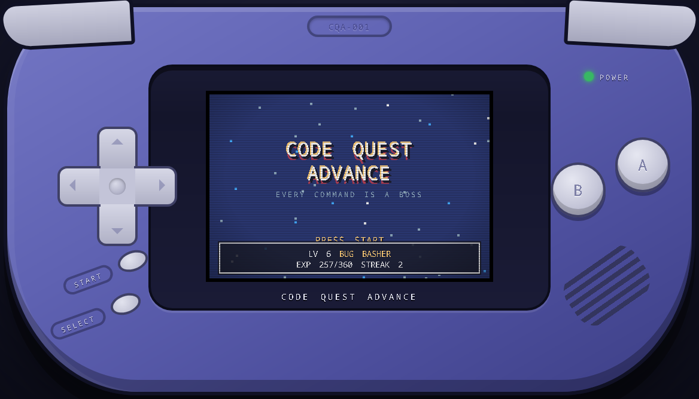
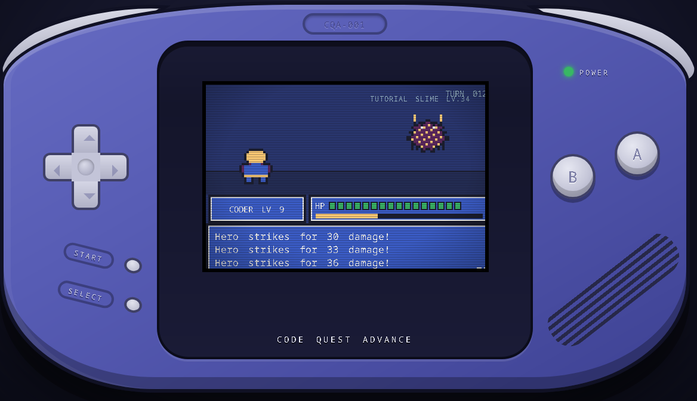

# CODE QUEST ADVANCE




## Controls

| Input | GBA | Action |
|-------|-----|--------|
| Arrow keys | D-pad | Navigate menus / play Oracle Datafall |
| D | A | Confirm / answer / fight |
| S | B | Back / abort quest |
| Enter | START | Start / confirm |
| Shift | SELECT | Reserved |
| A / F | L / R | Page the quest menu |
| P | POWER | Power on / off (or click the switch on the right edge) |
| C | SLOT | Open the cartridge tray (power must be off; or click the slot) |

All shell buttons are also clickable, including the L/R shoulders and the
power switch. The console starts powered off — flip the switch to boot.

## Cartridges

Cartridges are **local git repositories**. Click the cartridge slot on the
top edge (or press `C`) while the power is off, then **+ ADD FROM DISK** to
pick a directory with the native folder dialog. If the directory is a git
repo it loads as a cartridge — title from the directory name, label color
from a path hash — and is cached in the three-slot rack for future launches.
Drag a cached cartridge upward toward the device to load it; drag it downward
to recycle its rack entry without touching the repository on disk. Each label
shows the repository's current branch under its title and refreshes when the
rack opens. Click or Enter still loads, and Delete provides a keyboard recycle
action. If it isn't a git repo, the cartridge is refused with a message. The loaded cart
peeks out of the top-back slot GBA-style and is remembered between launches;
powering on with an empty slot halts on the boot logo, like real hardware.
Git trust is scoped to each command for the selected cartridge, allowing Windows
checkouts owned by an administrator account without changing global Git settings.

Loading a valid cartridge also creates an emulator-style save beside it. For
example, `/games/demo` uses `/games/demo.sav`; the git repository itself stays
untouched. The versioned JSON save is a generic namespaced data store so each
game style can own independent state without changing the file format. Quiz
mode currently uses one namespace for validated Claude question batches, which
lets later runs reuse generated results while retaining their level boundaries.
Ejecting or recycling a cartridge does not delete its save.

A repo cartridge's quests are generated from its contents: repo scrying
(`git status`), history (`git log`), and drift (`git diff`) always; plus a
Lint Gauntlet / Forge / Test Dungeon for `package.json` scripts, a Crate
Forge when `Cargo.toml` exists, and Make Mines for a `Makefile`. Swapping
requires ejecting first — remove and insert animations included.

**Game modes.** A repo may declare a versioned `CODEQUEST.toml` to select
`quiz` or `quest` mode, override its cartridge title, and define the finite-state
scene graph that the Bevy engine executes. Each scene chooses a trusted built-in
handler and routes its semantic events to other scenes; mechanics and art remain
linked design requirements. This repository's root
[`CODEQUEST.toml`](CODEQUEST.toml) makes CODE QUEST itself the reference
cartridge for exercising that contract. See the
[v2 contract](docs/reference/codequest-toml.md), its
[maintained example](docs/examples/CODEQUEST.toml), and the
[Oracle quiz storyboard](docs/game-design/oracle-quiz.md). Schema v1 manifests
still load as metadata and receive the built-in flow. Without a manifest, a repo
with `CODEQUEST.md` loads the legacy quest-battle mode and any other repo loads
the **ENDLESS REPO QUIZ**. Cartridge contents are data only: a cartridge cannot
add JavaScript, arbitrary conditions, or replace the game loop.

Quiz cartridges contain no preloaded questions. Inserting one makes the Bevy
engine ask the `claude` CLI for the first batch immediately. Character
creation, Oracle travel, and level-up screens keep the game moving while
Claude writes or prefetches the next batch; the Oracle waits and retries if a
batch fails instead of substituting generic questions. During the wait, use
Left/Right to dodge falling bugs and move into falling data. Contact collects
data automatically; Up, Down, and face buttons are inactive so input cannot
carry into a newly loaded question. Generated questions
cover the project's purpose, architecture, responsibilities, interactions,
invariants, and tradeoffs. The prompt and accepted-output policy live in
`src-tauri/src/lib.rs`: file and repository trivia is rejected, questions
must fit four 37-character lines, and each of four distinct choices must fit
35 characters. Set `CQA_NO_AI=1` to disable generation for diagnostics (the
Oracle will continue waiting), or `CQA_CLAUDE_MODEL` to select the model.
Quest-battle commands are selected from the Rust-derived cartridge quest list
and are started, streamed, and stopped by the Bevy runtime.

## Architecture

- `src-tauri/src/engine.rs` — the game. A headless Bevy app owns navigation,
  input edges, fixed-step timing, quiz/battle state, command execution, and a
  CPU-rendered 240×160 RGBA framebuffer.
- `src-tauri/src/codequest.rs` — the versioned `CODEQUEST.toml` data contract,
  parser, and cross-reference validation.
- `src-tauri/src/scene_machine.rs` — compilation and execution of cartridge
  scene graphs plus the built-in quiz and quest templates.
- `src-tauri/src/lib.rs` — the platform adapter. It validates git-repo
  cartridges, prepares data, and exposes only power, boot completion,
  cartridge, input, and framebuffer operations to the device UI.
- `src-tauri/src/save.rs` — the versioned, game-style-independent cartridge
  save store. It preserves namespaced payloads with atomic file replacement.
- `src/` — the JavaScript device shell. It owns the physical controls,
  cartridge tray, window fitting, the fixed device-firmware boot overlay, and
  copies the fixed-size Rust framebuffer into one canvas. It contains no
  gameplay state or game rendering. Bevy remains at its boot boundary until
  the device animation explicitly completes.

The framebuffer is always exactly 240×160 (153,600 RGBA bytes). Each pixel is
32-bit RGBA (8 bits per channel). Game text uses a purpose-built 5×7 glyph in
a 6×8 cell, the smallest size that keeps letters, digits, punctuation, and
repository paths distinct while fitting 40 columns. Button
presses can change its pixels, but cannot change its dimensions or the CSS
layout of the device, which prevents the mid-game rasterization shift that
the DOM-rendered version could trigger.

## Install

Tagged releases publish native packages for all supported desktop platforms:

| Platform | Package | Architecture |
|----------|---------|--------------|
| Linux | `.AppImage` | x86_64 |
| Windows | NSIS `.exe` and WiX `.msi` | x86_64 |
| macOS | `.dmg` and zipped `.app` | Universal (Apple Silicon + Intel) |

On Linux, make the AppImage executable and run it; there is nothing to install
and no toolchain required:

```bash
chmod +x code-quest-advance_0.2.1_amd64.AppImage
./code-quest-advance_0.2.1_amd64.AppImage
```

It carries GTK3 and WebKitGTK 4.1 inside it (~200 libraries), which matters most
on RHEL 9: that distro ships only the webkit2gtk **4.0** API, in BaseOS,
AppStream, CRB and EPEL alike, so Tauri v2 cannot be built or installed there at
all from stock packages. The AppImage sidesteps that entirely. Verified to boot
and render on RHEL 9 (glibc 2.34) and Fedora 43 (glibc 2.42).

The host supplies only its own graphics stack and fonts. On a machine with a
desktop session those are already present; on a bare/minimal host you need
`libGLESv2.so.2` (`libglvnd-gles`) and some fonts. If the host has no FUSE, run
it as `./code-quest-advance_0.2.1_amd64.AppImage --appimage-extract-and-run`.

On Windows, use either installer. On macOS, open the DMG and drag the app to
Applications. CI macOS packages use an ad-hoc signature so they can be built
without repository secrets; a public production release should be rebuilt with
a Developer ID certificate and notarized.

At runtime the app shells out, so `git` — plus `claude`, for AI question
generation — must be installed. On macOS the app repairs the restricted `PATH`
inherited by GUI applications before looking for them. Quest mode also needs
`bash`; macOS and Linux include it, and Git for Windows supplies it on Windows.
Folder selection uses each operating system's native dialog and has no external
helper.

On Windows, the app discovers Git for Windows and the native Claude executable
from `PATH` and their standard installation directories, so launching from the
Start menu does not depend on a terminal's environment. Portable or custom
installs can be selected with `CQA_GIT`, `CQA_CLAUDE`, and `CQA_SHELL`; each
value may be an executable name on `PATH` or an absolute path. The Windows quest
runner deliberately ignores the WSL `bash.exe` launcher because WSL cannot use
the Windows repository paths embedded in cartridge commands. Git, Claude, and
quest commands run as background processes without opening console windows.

## Build & run

```bash
npm ci
npm run tauri -- dev
npm run tauri -- build
```

For local Windows development, run those commands from PowerShell with Node.js,
the stable Rust MSVC toolchain, Microsoft C++ Build Tools plus a Windows SDK,
and the WebView2 runtime installed. A release build creates the application and
Windows bundles under `src-tauri/target/release/`.

Tauri produces native packages for the host operating system, so Windows and
macOS bundles must be built on their corresponding runners. For a universal
macOS package, install both Rust targets and request the virtual universal
target:

```bash
rustup target add aarch64-apple-darwin x86_64-apple-darwin
npm run tauri -- build --bundles app,dmg --target universal-apple-darwin
```

A native Linux host build is suitable for development but not for distribution:
a binary built on Fedora needs GLIBC_2.39 and will not start on RHEL 9, which has
2.34.

## Packaging a release

```bash
./packaging/build-appimage.sh    # Podman or Docker; writes dist/
```

That builds inside an Ubuntu 22.04 container — the oldest base carrying
webkit2gtk-4.1, which pins the portability floor at glibc 2.35 — then patches
the bundle down to RHEL 9's glibc 2.34 and repackages it. `packaging/Containerfile`
is the authoritative list of build dependencies and documents each compatibility
fix and why it exists. The build fails rather than emitting an artifact that
would die on a RHEL 9 loader.

The `Package` GitHub Actions workflow runs the Linux container build, Windows
MSI/NSIS build, and universal macOS app/DMG build in parallel. Run it manually
to obtain workflow artifacts, or push a `v*` tag to attach all packages and
checksums to a GitHub release. Windows packages are unsigned and macOS packages
are ad-hoc signed until platform signing credentials are supplied; signing does
not affect local or CI compilation.

Verify a change by rebuilding and re-running the smoke test in
`docs/runbooks/headless-gui-smoke-test/`, which drives the gameplay loop without
touching the desktop.

Engine status: playable end to end, with deliberately minimal procedural art
and room for production polish.
