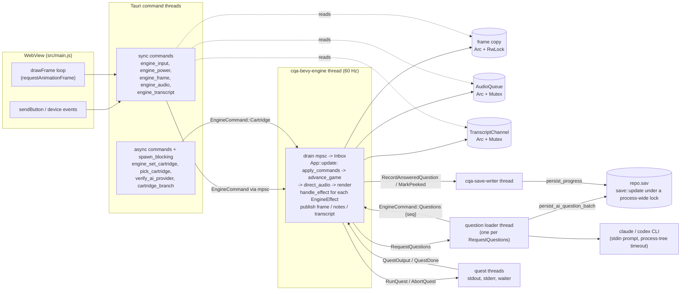
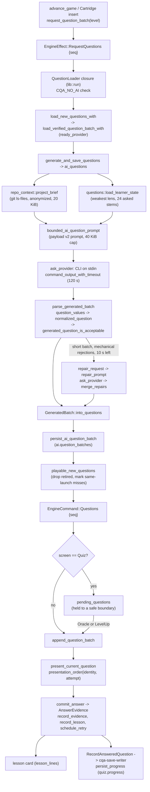
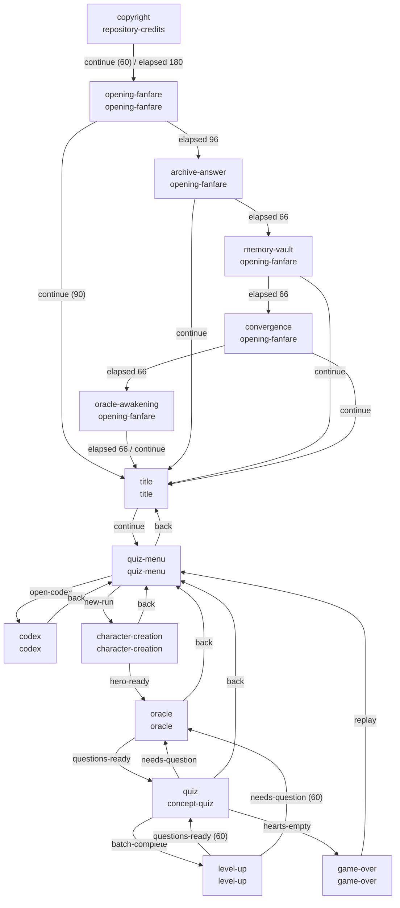

# CODE QUEST ADVANCE architecture

This guide is for people and agents who change the code. It describes how the
pieces fit, which module owns each decision, and the rules a change must keep.
Function and type names are the ones in the source, so every claim can be
checked with a search. Line numbers are left out on purpose: `engine.rs` moves
often.

The README covers installation, controls, and the player-facing rules. The
[Oracle quiz design](game-design/oracle-quiz.md) covers the pedagogy and the
per-scene design contract. This document covers the runtime.

## 1. The hard boundary

The engine owns all game state. The shell presents exactly three engine
outputs and sends back input edges and device events.

| Engine output | Produced by | Tauri command | Shell consumer |
|---|---|---|---|
| Framebuffer: one 240x160 RGBA image, `FRAME_BYTES` = 153,600 bytes | the `render` system writes the `Framebuffer` resource | `engine_frame` (raw `tauri::ipc::Response` bytes) | `drawFrame` in `src/main.js`, which copies the bytes into a canvas with `putImageData` |
| Chip notes: tick-stamped `audio::Note`s in an `AudioBatch` | the `direct_audio` system feeds `AudioOut` | `engine_audio` | `speaker.play` in `src/speaker.js` |
| Screen transcript: plain sentences with a sequence number | `GameEngine::transcript_sentences`, published through `TranscriptChannel` | `engine_transcript { since }` | `pollTranscript` in `src/main.js`, which writes a polite live region |

What flows the other way:

| Shell call | Engine effect |
|---|---|
| `engine_input { button, pressed }` | `EngineCommand::Input`; `apply_commands` turns it into a press edge (`handle_press` runs only when the button was not already held) |
| `engine_power`, `engine_finish_boot` | `EngineCommand::Power`, `EngineCommand::BootComplete` |
| `engine_set_cartridge { path }` | lib builds a `CartridgeSpec`, then `EngineCommand::Cartridge` |
| `engine_set_ai_provider`, `verify_ai_provider` | provider selection in `AiProviderState` (lib) and `EngineCommand::AiProvider` (display name only) |
| `engine_set_reduced_motion` | `EngineCommand::ReducedMotion`; renderers read `GameState::motion_ticks`, `settled_ticks`, and `blink_lit` |

Rules that follow from the boundary:

- `src/` holds no gameplay state and draws no game content. The shell owns
  only the physical device: the cartridge rack (`src/cartridge-library.js`),
  battery door, power switch, boot overlay, window fitting, volume wheel, and
  status strip (`src/device-shell.js`).
- Tauri commands never touch `GameState`. They send an `EngineCommand` over an
  `mpsc` channel (`EngineRuntime::send`) or read a shared copy of an output.
- Sound and the transcript are derived from state, like pixels. Gameplay code
  never calls audio and never writes transcript text.

## 2. Module map

| Module | Owns |
|---|---|
| `src-tauri/src/lib.rs` | Tauri commands, `AiProviderState` (selected vs verified provider), cartridge building (`build_cartridge`, `engine_cartridge`), provider calls (`ask_provider`, `command_output_with_timeout`), the generation pipeline (`ai_questions`), the question loader and answer recorder closures handed to the engine (`run`) |
| `src-tauri/src/engine.rs` | `GameState`, the Bevy schedule, input handling, the quiz run (`QuizRun`, `RunLedger`), the question deck and batches, retry scheduling, the lesson journal in memory, effects, CPU rendering, `EngineRuntime` |
| `src-tauri/src/engine/transcript.rs` | Screen sentences and `TranscriptChannel` |
| `src-tauri/src/audio.rs` | `AudioSnapshot`, `AudioDirector`, cues, loops, `AudioQueue` |
| `src-tauri/src/learning.rs` | `Concept` lenses, `Review`, `AnswerEvidence`, `LensRecord` and mastery gates, `Lesson`, `presentation_order`, rationale limits |
| `src-tauri/src/questions.rs` | Payload v2 (`QQuestion`, `QChoice`), acceptance policy, `Violation` diagnostics, repair, prompt construction, save batches and `SavedQuizProgress` |
| `src-tauri/src/repo_context.rs` | The anonymized, budgeted project brief (`project_brief`) |
| `src-tauri/src/scene_machine.rs` | `SceneHandler`, `SceneSignal`, `SceneMachineDefinition::compile`, the built-in quiz and quest templates, `SceneMachine` |
| `src-tauri/src/codequest.rs` | `CODEQUEST.toml` parsing, validation, and `runtime_machine` |
| `src-tauri/src/save.rs` | The sibling `<repo>.sav` file, `save::update` (serialized, atomic read-modify-write) |
| `src-tauri/src/provenance.rs` | Author ranking and explicit copyright detection for the chronicle card; `sanitized_metadata` for device-visible strings |
| `src-tauri/src/external_tools.rs` | Discovery of `git`, `claude`, `codex`, and the quest shell; `isolate_process_tree` and `kill_process_tree` |
| `src-tauri/src/question_eval.rs` (test only) | The live question-quality eval |
| `src-tauri/src/property_tests.rs` (test only) | Seeded property tests for the pure logic |

## 3. Threads and the runtime



### `EngineRuntime`

`EngineRuntime::spawn(question_loader, answered_question_recorder)` starts the
`cqa-bevy-engine` thread and returns a cloneable handle holding the command
sender and the three shared outputs. `run` in `lib.rs` stores it as Tauri
state (`EngineState`). Each loop iteration:

1. Drains every pending `EngineCommand` from the channel into the `Inbox`
   resource (`GameEngine::command`).
2. Runs `App::update`. `GameEngine::new` registers one chained schedule:
   `apply_commands`, `advance_game`, `direct_audio`, `render`. One update is
   one tick.
3. Takes the `Effects` queue (`GameEngine::take_effects`) and runs
   `handle_effect` for each entry, outside the Bevy schedule.
4. Copies the framebuffer into the shared `RwLock`, appends the tick's notes
   to the shared `AudioQueue`, and publishes the transcript.
5. Sleeps until the next `FRAME_TIME` (16,666,667 ns). When it falls behind it
   re-anchors to now instead of running catch-up ticks.

The shell never drives the tick rate. It reads whatever the latest copy is.

### Commands and effects

`EngineCommand` is everything that enters the engine: `Power`,
`ReducedMotion`, `AiProvider`, `BootComplete`, `Cartridge`, `Questions`,
`Input`, `QuestOutput`, `QuestDone`. Only `apply_commands` handles them.

`EngineEffect` is everything that leaves it: `RunQuest`, `AbortQuest`,
`RequestQuestions { cartridge_id, level, count, seq }`,
`RecordAnsweredQuestion { cartridge_id, evidence }`, and
`MarkPeeked { cartridge_id, question }`. Engine systems push
effects; `handle_effect` executes them on the engine thread after the update:

- `RequestQuestions` spawns a thread that calls the `QuestionLoader` closure
  and sends the result back as `EngineCommand::Questions` with the same `seq`.
- `RecordAnsweredQuestion` and `MarkPeeked` call the
  `AnsweredQuestionRecorder` closure with a `learning::ProgressEvent`
  (`Answered` or `Peeked`). The closure built by `answer_recorder_with` only
  sends on a channel; the `cqa-save-writer` thread applies events in the
  order they happened, so a durable save write never stalls a frame.
- `RunQuest` calls `run_quest`, which spawns the quest shell with
  `isolate_process_tree`, stores the child in a shared slot, and starts
  stdout, stderr, and waiter threads. `AbortQuest` calls `kill_process_tree`
  on that child. The waiter (`wait_for_quest_shell`) gives in-flight output
  `QUEST_OUTPUT_GRACE` (1 s) and then kills any helper still holding the
  pipes.

### Request sequence numbers

At most one question request is in flight per insert.
`request_question_batch` refuses while `questions_loading`,
`pending_questions`, or `question_retry_ticks > 0` is set, increments
`GameState::question_request_seq`, and records `question_request_level`.

Inserting a cartridge (`EngineCommand::Cartridge`) clears the loading state
and increments the sequence again, so a request made for the previous insert
can still be running. `apply_commands` drops a `Questions` reply unless its
`cartridge_id` is the current quiz cartridge and its `seq` equals
`question_request_seq`. A superseded reply cannot end the newer request's
loading state, add a batch, or report a failure.

A failed or empty reply sets `question_failure` (through
`oracle_failure_reason`, at most 24 characters) and
`question_retry_ticks = 300` (5 s). `advance_game` requests again once the
delay runs out and the next question is still missing.

### Other threads

- Tauri runs sync commands on its command threads. The async commands
  (`engine_set_cartridge`, `pick_cartridge`, `cartridge_branch`,
  `verify_ai_provider`) move git, save, and CLI work onto `spawn_blocking`.
  `CartridgeLoads::order` keeps overlapping cartridge loads in request order,
  and `PickedCartridge` lets the insert that follows a folder pick reuse that
  build for up to 30 s.
- `command_output_with_timeout` starts a stdin writer thread and two pipe
  readers (`read_to_end_in_background`). On timeout it kills the process tree
  and abandons the readers instead of joining them, so a grandchild holding
  the pipes cannot hold the call past its deadline. On Windows `taskkill /T`
  cannot reach a helper that outlived its parent; the call still returns on
  time (see `kill_process_tree`).
- `save::update` holds a process-wide lock (`save_write_lock`) for the whole
  read-modify-write, so a batch saved by a loader thread and an answer saved
  by the writer thread cannot lose each other.

## 4. Power, boot, and cartridge insert

1. Batteries: `engine_set_ai_provider` records the selection;
   `AiProviderState::select` clears verification whenever the selection
   changes. `verify_ai_provider` runs `prove_ai_provider`, which sends
   `AI_PROBE_PROMPT` through the same stdin path as generation (60 s limit) and
   requires the reply `CODEQUEST_READY`. `mark_verified` fails if the
   batteries changed during the check.
2. Power on: `setPower` in `main.js` verifies the provider first, then calls
   `engine_power { powered: true }`. `engine_power` refuses power-on unless
   `ready_provider()` returns the verified provider. The engine clears held
   buttons and the run, aborts any quest, and transitions to `Screen::Boot`.
3. Boot: the shell shows its boot overlay for `BOOT_DURATION_MS` (2600 ms) and
   calls `engine_finish_boot`. `BootComplete` calls `GameState::start_machine`,
   which resets the scene machine to its start scene. Nothing leaves `Boot`
   without a cartridge.
4. Insert: `engine_set_cartridge` runs `load_cartridge`: `build_cartridge`
   canonicalizes the path, requires a Git repository, loads
   `CodeQuestConfig::load`, creates the save (`SaveFile::open_or_create`),
   builds quests, provenance, branch, and revision, and picks the mode.
   `engine_cartridge` compiles the scene machine (the manifest's
   `runtime_machine`, else `SceneMachineDefinition::template`) and loads saved
   questions, lessons, mastery, and attempts (`load_cartridge_questions`).
5. In the engine, `EngineCommand::Cartridge` builds a new `SceneMachine`,
   resets the run and deck state, rebatches the saved deck (`rebatch`),
   increments the request sequence, and requests a level-1 batch at once when
   a quiz cartridge has no saved questions. Generation therefore runs behind
   the credits and opening scenes.

Mode selection (`build_cartridge`): a manifest's `game.type` decides; with no
manifest, `CODEQUEST.md` selects the quest mode (`"custom"`); otherwise the
cartridge is an endless quiz.

## 5. The question pipeline



### 5.1 The project brief

`repo_context::project_brief(repo, tracked)` builds a deterministic brief of
at most `BRIEF_BUDGET` (20 KiB) of plain ASCII from the tracked files that
`tracked_files` lists (`git ls-files -z`, at most 20,000 paths). In order:

- `CARTRIDGE SUMMARY:` from the manifest's `game.summary` (`cartridge_summary`).
- `README EXCERPT:` from the root README's prose (`readme`, `markdown_prose`).
- `DESIGN NOTE n:` outlines (headings and leading paragraphs) of design
  documents in the priority order `design_documents` assigns.
- `COMPONENT SKELETONS`: doc comments and top-level signatures of up to
  `MAX_COMPONENTS` (30) source files, each labelled `--- COMPONENT n ---`.
  `spread_sources` takes one file per directory per round, largest first, and
  the project's own directories before tooling, packaging, and shell scripts.
  `component_allocations` shares the remaining budget, at most
  `COMPONENT_BUDGET` bytes each.

`Redactor` removes anything shaped like a path, file name, extension, or
link, and any word that names a tracked file or directory. No excerpt names a
location, so questions stay conceptual.

### 5.2 The prompt (payload v2)

`questions::ai_question_prompt` asks for exactly `count` questions at `level`
and states:

- The tier (Initiate at 1, Adept at 2–3, Oracle-bound at 4+) and the five
  lenses with a guide line each (`lens_guide`).
- FOCUS: at least `focus_minimum(count)` (4 of 6) questions on
  `Concept::focus_for_level(level)`.
- TRANSFER at level 4 and above: at least `count.min(2)` questions beginning
  `PREDICT:`. Acceptance does not check the prefix.
- The trivia ban, the choice rules, and the rationale rules, with
  calibration strings so the provider can judge lengths.
- The display limits, taken from the same constants the renderer uses.
- LEARNER STATE: the weakest lens (`weakest_lens`: most misses relative to
  evidence) and up to `MAX_AVOIDED_STEMS` (24) earlier stems.
- The JSON schema: `[{"q", "concept", "choices": [{"text", "why"} x4], "answer"}]`.

`bounded_ai_question_prompt` trims the brief at a character boundary only if
the whole prompt exceeds `MAX_PROMPT_BYTES` (2 x `BRIEF_BUDGET`). A brief within
its own budget always fits.

### 5.3 The provider call

`ai_questions` checks the repository with `git_repo_check_within`, then calls
`ask_provider` with `AI_QUESTION_TIMEOUT` (120 s). `ai_prompt_command` builds:

- Claude: `claude -p --output-format json --no-session-persistence --tools ""`
  (plus `--model $CQA_CLAUDE_MODEL`). `ai_response_text` reads the `result`
  field of the JSON envelope.
- Codex: `codex exec --ephemeral --sandbox read-only --skip-git-repo-check
  --color never [--model $CQA_CODEX_MODEL] -`. The reply is stdout.

The prompt always travels on stdin (`PromptCall`), never as an argument.
`provider_reply` turns a non-zero exit into `"<PROVIDER> CALL FAILED - <reason>"`,
using `failure_line` to find the meaningful stderr line past the CLI's
preamble.

### 5.4 Parsing and the acceptance policy

`parse_generated_batch` finds the first JSON array whose elements carry `"q"`
(`question_values`), even inside prose or code fences or cut off mid-array
(`leading_array_values`). Each object is deserialized, normalized
(`normalized_question`: typographic punctuation folded to ASCII, whitespace
collapsed, uppercased, lens spelling canonicalized), and split by
`generated_question_is_acceptable`:

- `engine::quiz_question_fits`: a non-empty question that wraps into at most
  `QUIZ_QUESTION_ROWS` (4) lines of `QUIZ_QUESTION_COLUMNS` (31), exactly four
  distinct non-empty choices of at most `QUIZ_CHOICE_CHARS` (31), and a valid
  answer index.
- No trivia in the question or choices (`cites_trivia`), and no location in a
  rationale (`cites_location`).
- `has_complete_rationales`: a lens `Concept::parse` knows and a `why` for
  every choice that fits `RATIONALE_ROWS` (3) lines of `RATIONALE_COLUMNS`
  (34) (`learning::rationale_fits`).
- Every string renders in the handheld font (`renderable`: printable ASCII).

Valid questions survive a mixed batch. `accepted_question_batch` keeps each
identity once, up to `count`. Rejected but readable questions are kept in
`GeneratedBatch::rejected`.

Saved questions use the looser `question_is_acceptable`, which also admits
legacy questions with plain-string choices and no rationales.

### 5.5 The repair pass

`question_violations` measures every reason a question fails, with the same
primitives as the policy. `Violation::is_mechanical` is false only for
`Trivia` and `Malformed`: those questions ask the wrong thing and are never
repaired.

When the batch is short, `GeneratedBatch::repair_request` collects up to
`count` rejected questions whose violations are all mechanical
(`is_repairable`) and builds `repair_prompt`: for each question, the exact
fields that break which limit and by how much, then the question JSON with an
`id`. `ai_questions` sends it through the same provider if at least
`MIN_REPAIR_TIME` (10 s) of the 120 s budget remains. `merge_repairs` accepts a
repair only if it echoes a sent `id`, keeps that question's answer index,
passes the full policy, and repeats nothing. The batch never exceeds `count`.

`GeneratedBatch::into_questions` fails with `INCOMPLETE OR INVALID QUESTIONS`
when nothing survived.

### 5.6 Saving batches and filtering for play

`generate_and_save_questions` persists the accepted batch with its level
(`persist_ai_question_batch`, appended to `ai.question_batches` as raw JSON so
entries a newer build wrote are carried forward). `load_new_questions_with`
then maps it through `playable_new_questions`: retired identities are dropped,
and a stem the progress lists as missed arrives as `Review::InSession`.

On failure the loader closure in `run` logs the full error and returns the
short category from `question_failure_reason` (`TIMED OUT`, `RATE LIMITED`,
`LOGIN NEEDED`, `REJECTED BATCH`, and so on). The engine shows it on the
Oracle line.

### 5.7 The engine deck: batches and levels

The cartridge's `questions` vector is the deck. `GameState::batch_ends` marks
batch boundaries and `batch_levels` holds each batch's generation level. A
batch is full when it holds `QUESTION_BATCH_SIZE` (6) new questions; review
copies ride along without counting (`new_question_count`, `batch_is_full`).

- `append_question_batch` skips identities already in the deck or waiting as
  deferred retries, tops the open last batch up to six new questions, forms
  new batches from the rest at the requested level, then calls
  `place_deferred_retries`.
- A delivery that arrives while the screen is `Quiz` is held in
  `pending_questions` and appended by `advance_game` on the `Oracle` or
  `LevelUp` screen, so the deck never shifts under a question on screen.
- `next_batch_level` asks for the level the run will have reached when the new
  questions start (one level per full batch still ahead), and never a level
  already queued; an open last batch is topped up at its own level.
- `advance_game` prefetches while at most six questions remain ahead in the
  quiz, and keeps a catch-up request in flight on any powered screen where
  `has_next_question` is false.
- `continue_after_lesson` completes a batch exactly at its end. A full batch
  raises `run.level`, closes the ledger's batch, and signals `BatchComplete`. A
  short batch with questions after it merges into the next one, so a level-up
  always means a full batch was survived. Running out of questions signals
  `NeedsQuestion` (back to the Oracle).
- `consumed_questions` marks the deck prefix committed this launch.
  `retire_consumed_questions` drops it when a run ends or a new one starts,
  requeues consumed questions whose lesson is still outstanding at the front
  as `Review::InSession`, and rebatches.
- Saved batches load lowest level first (`cartridge_questions`), so a new run
  does not open on leftover Oracle-bound questions.

Run lifetime follows screens, not scenes: `GameState::transition` starts a
run (`start_quiz_run`) whenever the Oracle or quiz screen is entered from
outside the run screens (`Oracle`, `Quiz`, `LevelUp`), or with a broken ward.

### 5.8 Presentation order

`present_current_question` runs once per question index. It reads the
identity's committed attempt count from `CartridgeSpec::question_attempts`
(loaded from the save, raised to at least 1 for a review) and sets
`run.order = learning::presentation_order(identity, attempt)`.
`presentation_order` hashes the identity (FNV-1a) to one of the 24
permutations and rotates it by `attempt % 4`, so the order is stable across
runs and platforms and every retry moves every choice. `run.selected` is a
display slot; `QuizRun::source_choice` maps it back to a source index.

### 5.9 Commit, lesson card, and evidence

`commit_answer` (A on the quiz screen, outside the lesson hold):

1. Scores the pick: a correct answer raises the streak and adds
   `score_award_for_streak`; a miss costs a ward and resets the streak.
2. Opens the lesson card: `run.feedback = (correct, QUIZ_FEEDBACK_TICKS)` (45
   ticks of ignored input, then A or Start continues via
   `continue_after_lesson`). `lesson_lines` composes a miss as the pick (`-`,
   red) with its misconception, then the answer (`+`, green) with its
   rationale; a success shows the answer only.
3. Increments `question_attempts` for the identity.
4. Grades the attempt: a `Review::Fresh` question whose stem the journal
   already holds is regraded as `InSession`. It builds `AnswerEvidence
   { question, concept, correct, review, picked, peeked }`: `picked` is the
   source index of a miss's pick, and `peeked` is true when the player
   revealed this pending lesson's answer in the Codex first.
5. Updates mastery (`learning::record_evidence`) and the journal
   (`record_lesson`, keyed by identity), and sets `run.lens_woke` when the
   gated stage rose.
6. Schedules the retry of a survivable miss (`schedule_retry`) and sets the
   `RetryNote` the card shows.
7. Pushes `EngineEffect::RecordAnsweredQuestion`.

### 5.10 Saving progress and mastery

The engine hands the host a `learning::ProgressEvent`: `Answered(evidence)`
for a commit, or `Peeked { question }` for a Codex reveal. The writer thread
calls `questions::persist_progress`, which applies `SavedQuizProgress::apply`
in one `save::update` of `quiz.progress`. An answer goes through
`SavedQuizProgress::record`:

| Outcome | List it moves to | Attempt count |
|---|---|---|
| Correct, `Fresh` or `Spaced`, no peek | `answered_questions` (retired) | removed |
| Correct, `InSession`, or any correct answer after a peek | `relearned_questions` | incremented |
| Wrong, any | `missed_questions` | incremented |

The three lists never share an identity. `SavedQuizProgress::retired` excludes
anything still missed or relearned. A miss also records its pick in
`missed_picks` (kept after a later correct answer), and every attempt clears
the identity from `peeked_questions`. A `Peeked` event adds the identity to
`peeked_questions` only while it is still missed. The same call updates
`mastery` with `learning::record_evidence`, so the save and the engine apply
the same rule.

On the next load, `cartridge_questions` queues missed and relearned
questions as `Review::Spaced`, drops retired ones, and journals every recorded
question (`QQuestion::lesson`, outstanding when missed, with the saved pick's
misconception and the peek flag).

## 6. The learning model

All of this lives in `learning.rs`, which depends on neither Tauri nor Bevy.

### Lenses

`Concept` has five lenses: `Purpose`, `Responsibility` (label `ROLES`),
`Interaction` (`FLOWS`), `Invariant`, and `Tradeoff`. `Concept::parse` accepts
case, plurals, and synonyms from providers and rejects anything else.
`Concept::focus_for_level` gives Purpose and Responsibility at level 1,
Interaction and Tradeoff at 2–3, and Invariant and Tradeoff at 4+.

### Review kinds

`Review` records why a question is asked, which decides what a correct answer
proves:

| Kind | Arises from | Correct answer counts as |
|---|---|---|
| `Fresh` | first appearance | evidence (`first_try`), graded |
| `InSession` | `schedule_retry`, `retire_consumed_questions` requeue, `playable_new_questions` for a same-launch miss, `commit_answer` regrading a journaled stem | relearning (`relearned`), not graded |
| `Spaced` | `cartridge_questions` for a question missed or relearned in an earlier launch | evidence (`redeemed`), graded |

A miss of any kind increments `missed` and is graded. Whatever the kind, a
correct answer with `AnswerEvidence::peeked` set (the answer was revealed in
the Codex first) is relearning, not graded.

### Retry spacing

`RETRY_GAP` is 3. `schedule_retry` inserts an `InSession` copy exactly three
questions after the miss (`retry_insertion_index`) and shifts every batch end
at or past that index, so a copy past the batch end joins the next batch and
the current batch still closes on time. When the deck is too short, the copy
goes to `GameState::deferred_retries` with its due index, and
`place_deferred_retries` inserts it after a later delivery (never before
`run.question + 1`). The card's `RetryNote` says `BACK IN n`, `LATER`
(deferred), or `NEXT RUN` (the ward broke). A new run drops deferred copies;
their outstanding lessons requeue through `retire_consumed_questions`.

### Relearned vs redeemed

- Relearned: a correct `InSession` answer, or a correct answer of any kind
  after a Codex peek. It clears the pending review (the
  lesson is no longer outstanding), is bannered `REDEEMED` on the card
  (`run.redeemed`), and moves the question to `relearned_questions`. It lights
  no rune, because the lesson card just showed the answer. The question
  returns once as a `Spaced` check in a later launch.
- Redeemed: a correct `Spaced` answer. It is evidence and retires the
  question.

`RunLedger::record` follows the same grading for the debriefs: only non-review
answers count as first tries, and any correct review counts toward the
run's `REDEEMED` total.

### Mastery runes

`LensRecord` keeps `first_try`, `redeemed`, `missed`, `relearned`, and a shift
register of the newest graded outcomes (`recent`, `recent_len`, capacity
`RECENT_CAPACITY` = 8). Every field defaults, so older saves load.

- `evidence()` is `first_try + redeemed`.
- `volume_stage()` is the number of `MASTERY_THRESHOLDS` ([1, 3, 5]) the
  evidence reaches.
- `stage_with(outstanding)` applies two gates over the newest
  `MASTERY_GATE_WINDOW` (5) outcomes: rune II needs at least 60% correct, and
  rune III needs at least 80% and no outstanding miss on the lens. A record
  with no recent outcomes passes the accuracy gates.
- `cracks_with(outstanding)` is `volume_stage - stage_with`: runes the volume
  earned that a gate holds back. Renderers draw them cracked
  (`mastery_meter_styles`), meaning a review is due.

`engine::lens_stage` is the one stage rule the trial footer, the Codex, and
the lens-wake check share; it counts outstanding lessons with
`pending_reviews`. Insight Runes (score thresholds 300, 900, 1800) and
Datafall charge and seals are separate, run-only meters.

### The Codex

The Codex screen pages between a mastery overview (page 0) and one page per
journal lesson (`codex_page_count`, `codex_lesson`). A learned page shows the
question, the answer, its rationale, and `LEARNED`, plus `ONCE CHOSE:` when
the lesson remembers a misconception (`Lesson::misconception`). The Codex
never changes the deck or mastery.

A pending page is a self-test. It opens sealed (`codex_answer_sealed`): it
shows `YOU CHOSE`, the player's own wrong pick, and its misconception (or
`THINK, THEN A:REVEAL` for a miss saved before picks were recorded), and the
answer panel reads `A:REVEAL ANSWER`. A or Start reveals the answer
(`reveal_codex_answer`, `GameState::codex_revealed`); A and Start are inactive
on every other page, and every page turn and every visit seals the page
again. The first reveal marks the lesson `peeked` (status `PENDING PEEKED`)
and emits `EngineEffect::MarkPeeked`, which the host persists as
`quiz.progress.peeked_questions` through the same ordered save writer. The
next correct answer to a peeked question counts as `LensRecord::relearned`,
not evidence, moves it to `relearned_questions` so it returns once more as a
spaced check, and any attempt clears the peek. The reveal plays
`Cue::QuestionReveal`, and the screen transcript reads the sealed page
without the answer.

## 7. The scene machine and manifest compilation

### Handlers, signals, transitions

`SceneHandler` names a built-in engine behavior; `Screen::from(SceneHandler)`
maps it to the engine screen. `SceneSignal` is a semantic event the engine
emits. `SceneHandler::supports` lists which signals each handler can emit. A
`SceneTransition { signal, target, after_ticks }` routes a signal to a target
scene.

`SceneMachineDefinition::compile(start_scene, specs)` refuses:

- empty or duplicate scene ids, or a missing start scene;
- a transition to a missing scene;
- a signal the handler cannot emit;
- an `elapsed` transition without `after_ticks`;
- two transitions on one signal in one scene;
- any scene unreachable from the start scene.

`SceneMachine::handle` treats `SceneEvent::Tick` as the `Elapsed` signal after
incrementing the scene's elapsed ticks. For any signal, a transition fires
only once `elapsed_ticks >= after_ticks`, so on a non-elapsed signal
`after_ticks` is a minimum dwell (the reference level-up ignores A for 60
ticks). `can_handle` answers the same question without moving.

The engine uses the machine through `GameState::signal`, `tick_machine`
(every tick outside `Off` and `Boot`), and `can_signal`. For example, the quiz
menu's second option opens the Codex only when `can_signal(OpenCodex)` holds,
and otherwise falls back to `Back`.

### Manifest compilation

`CodeQuestConfig::parse` deserializes `CODEQUEST.toml` with
`deny_unknown_fields` everywhere, then `validate` checks the schema version (1
or 2), non-empty text, unique ids, resolved mechanic and art references, and
the start scene. In schema v2 every scene needs a handler, `next` is
forbidden, and `handler_supports_game` limits handlers to the game family
(credits, opening, and title for both; the quiz handlers, including `Codex`,
for quiz games; the quest handlers for quest games). `validate` ends by
calling `runtime_machine`, which compiles the scenes with
`SceneMachineDefinition::compile`. A manifest that does not compile refuses
the cartridge. Schema v1 returns `None`, and `engine_cartridge` falls back to
`SceneMachineDefinition::template`.

Art entries with a `template` (`VisualTemplate`) select built-in renderers:
each `render_*` function checks `GameState::uses_visual_template` for the
current scene and otherwise draws its legacy layout. `opening_beat` picks the
opening plate from the scene's art ids. Mechanics and template-less art are
validated metadata only.

### The reference cartridge

The repository's own `CODEQUEST.toml` (schema 2, `type = "quiz"`,
`start_scene = "copyright"`) compiles to this graph. Numbers are
`after_ticks`.



Who emits what:

- `handle_press` emits `Continue` (A or Start on credits, opening, and title;
  A, B, or Start on the quest result screens), the menu's `NewRun`/`OpenCodex`/`Back`, `HeroReady` through
  `begin_quiz_run`, `Back` from the Oracle (`leave_quiz_run`) and from the quiz
  on a second B within `QUIZ_LEAVE_CONFIRM_TICKS` (90), `Replay` on game over,
  and the level-up continuation (`level_up_signal`).
- `advance_game` emits `QuestionsReady` from the Oracle once a question exists
  and the Datafall has run at least 75 ticks, `NeedsQuestion` from the quiz
  when the deck runs out, and the level-up continuation automatically at 180
  ticks.
- `continue_after_lesson` emits `BatchComplete`, `NeedsQuestion`, or
  `HeartsEmpty`.

## 8. The audio director

Sound is a pure function of observed state changes.

1. `direct_audio` builds an `AudioSnapshot` each tick with `audio_snapshot`:
   power, `AudioScene`, scene ticks, held buttons as `pad` bits, menu and
   hero cursors, Codex page, the run (`RunAudio`: question, selection, answer
   phase, wards, multiplier, insight stage, level, `redeemed`, `lens_woke`,
   leave arming), Datafall counts and stages, `QuestionStatus` (the same
   `GameState::question_status` the Oracle line uses), and the presentation
   `Tier`.
2. `AudioOut::observe` passes it to `AudioDirector::observe`, which diffs it
   against the previous snapshot:
   - Not audible (off, boot, or an `Unlisted` scene): `stop_scene` cuts every
     sounding voice on this tick.
   - Scene changed: `stop_scene`, `schedule_script` (the scene's scripted
     tones, such as the opening beats), a new loop from `scene_loop` anchored
     a few ticks later, and at most one `entry_cue` keyed by the previous and
     next scene.
   - Same scene: `follow_loop` swaps the bed when the state asks for another
     one (for example `DANGER_BED` at one ward), and `scene_event` picks the
     highest-priority cue among this tick's changes (`datafall_events`,
     `quiz_events`, cursor moves, page turns). A press edge that changed
     nothing gets `Cue::Unavailable` where `accepts_unavailable` allows it.
3. `play` starts the cue and first cuts whatever the previous cue still owns,
   so cues replace each other instead of stacking. `emit_loop` plays loop
   steps only on voices no cue or script has reserved, so loops yield and
   resume.
4. A cut followed by a note on the same voice and tick is removed.

Priorities (`Cue::priority`, higher wins): `Unavailable` 1; navigation, page
turns, cursor, traits, and question reveal 2; `DataCollect` 3; `BugHit` 4;
`Retry` and `LeaveWarning` 5; `Ready` and `ChargeRune` 6; `SealBreak` 7;
`Correct` and `Wrong` 8; `Redeemed`, `FlowUp`, and `LowWard` 9; `RuneAwaken`
and `WardBreak` 10; `LensWake` 11; scene-level cues (confirm, cancel, begin,
leave, batch complete, continue, defeat, replay, victory) 12. Within one
commit, `quiz_events` already picks one result: a woken lens rune, then a new
Insight Rune, then a redemption, then a flow increase, then plain correct.

Loops (`scene_loop`): `TITLE_LOOP` on the title; `MENU_LOOP` on the quiz menu,
hero creation, and quest select; a Datafall arrangement per tier
(`DATAFALL_INITIATE`, `DATAFALL_ADEPT`, `DATAFALL_ORACLE_BOUND`) in the Oracle;
`DANGER_BED` in the quiz at one ward; `BATTLE_LOOP` in battle. The Codex has
no loop. Loop volumes stay at or below `AMBIENCE_MAX_VOLUME` (5).

The voice model is four monophonic voices (two pulses with duty, a wave, and
noise). A note replaces what its voice was sounding, and a zero-volume note is
a cut. `AudioQueue` holds at most `AUDIO_QUEUE_CAPACITY` (512) notes and drops
the oldest when the shell falls behind. In `speaker.js`, `createTickClock`
maps engine ticks to the WebAudio clock, keeping the newest tick between 20
and 120 ms ahead (60 ms target). Volume is a shell setting; the engine never
knows it.

## 9. The transcript contract

- `screen_sentences(state)` describes the current `Screen` in reading order:
  the question, choices in display order with the focused one marked
  `, selected.`, the lesson card, Codex pages, the Oracle's status and line,
  and the controls that work. `Off` and `Boot` are silent.
- It must derive every sentence from the same state and helpers the renderer
  uses (display order, lesson composition, feedback banner,
  `question_status`, `quiz_menu_second_option`, and so on), so words and
  pixels cannot disagree. Decorative motion, blinking, and staged reveals are
  left out.
- The engine loop calls `TranscriptChannel::publish` every tick. It records a
  new publication, and increments `seq`, only when the sentences differ from
  the latest one. It keeps the last `TRANSCRIPT_HISTORY` (32) publications.
- `transcript_since(seq)` returns `None` when the reader is current. When the
  reader's publication is still in history and on the same screen, it returns
  `announcement(old, new)`: appended sentences alone, or the few sentences that
  changed in place (skipping a choice that merely lost focus), or the whole
  screen when the heading or most of it changed. Otherwise it returns the
  whole screen.
- The shell polls every `TRANSCRIPT_POLL_MS` (150 ms) from `drawFrame`, behind
  an in-flight guard, and replaces the live region's text only when `seq`
  changes.

When you change what a screen shows, change its transcript function in the
same commit. `tests/device-transcript-contract.mjs` checks the shell side;
the tests in `engine/transcript.rs` check the sentences.

## 10. Persistence

- The save sits beside the repository, never inside it: `save::path_for`
  turns `/games/demo` into `/games/demo.sav`. It is a JSON document with
  `schema_version` 1 and a `data` map.
- Keys: `ai.question_batches` (current batches), `claude.question_batches`
  (legacy, read first so it counts as older), and `quiz.progress`
  (`SavedQuizProgress`).
- Every write goes through `save::update`: it holds the process-wide lock,
  re-reads the document from disk, refuses to replace a value it cannot
  deserialize or a file that does not parse, and writes only when the value
  changed, through a synced temporary file renamed over the save
  (`persist_document`).
- New fields use `#[serde(default)]` (and `skip_serializing_if` where an empty
  value should keep the old shape), so saves from earlier builds load
  unchanged. `saved_batch` skips an unreadable question without discarding
  its batch.

## 11. Invariants to keep

1. The shell holds no game state, and the engine does no device chrome.
2. Only `apply_commands` changes state in response to the outside; only
   `handle_effect` performs side effects, after the update.
3. The engine thread never blocks on git, a CLI, or disk. Cartridge building
   happens in lib before `EngineCommand::Cartridge`; generation runs on loader
   threads; saves go through the writer thread.
4. A question reply lands only with the current cartridge id and request
   sequence.
5. The deck never changes under a question on screen: deliveries wait in
   `pending_questions` during `Quiz`.
6. Acceptance limits come from the renderer's constants
   (`QUIZ_QUESTION_COLUMNS`, `QUIZ_QUESTION_ROWS`, `QUIZ_CHOICE_CHARS`,
   `RATIONALE_COLUMNS`, `RATIONALE_ROWS`), and the prompt, repair prompt,
   `question_violations`, and eval all read the same ones.
7. Only first tries and later-launch redemptions are mastery evidence.
8. Every reachable input is an edge. Held keys never repeat, the lesson hold
   ignores input, and leaving a question takes two B presses.

## 12. Making common changes

- New scene handler: add it to `SceneHandler` and `SceneHandler::supports`,
  `handler_supports_game`, `Screen` and `Screen::from`, `handle_press`,
  `render`, `screen_sentences`, `audio_snapshot` (`AudioScene`), and
  `entry_cue` where it needs an entry sound. Update the templates in
  `SceneMachineDefinition::template` if the built-in flow uses it.
- Changing a display limit: change the engine or learning constant; the
  prompt, repair prompt, violations, and eval follow. Check the calibration
  strings in `ai_question_prompt` still match the new limit.
- New progress field: add it with serde defaults to `SavedQuizProgress` or
  `LensRecord`, update `SavedQuizProgress::record` and the engine's matching
  path in `commit_answer`, and add a legacy-load test beside
  `legacy_progress_without_relearning_fields_loads`.
- New manifest field: the structs use `deny_unknown_fields`, so update
  `codequest.rs`, `docs/reference/codequest-toml.md`, both `CODEQUEST.toml`
  copies, and the validator in `.agents/skills/codequest-game-designer`.

## 13. How to verify

The core checks match CI (`.github/workflows/ci.yml`):

```bash
node --check src/main.js
npm test                  # the tests/*-contract.mjs shell contracts
cargo fmt --manifest-path src-tauri/Cargo.toml --check
cargo clippy --manifest-path src-tauri/Cargo.toml --all-targets -- -D warnings
cargo test --manifest-path src-tauri/Cargo.toml
npm run tauri -- build --no-bundle
python3 .agents/skills/codequest-game-designer/scripts/validate_codequest.py CODEQUEST.toml
```

CI also runs clippy and the Rust tests on Windows and macOS (`verify-native`),
the only hosts that compile the platform-specific tool discovery, process-tree
shutdown, and shell-path code.

Where the Rust tests live:

- `engine.rs` `mod tests`: scenario tests that drive a `GameEngine` with
  commands and ticks and assert on screens, deck, frames, and audio.
  `engine/transcript.rs` has the same kind of tests for the transcript.
- `learning.rs`, `questions.rs`, `scene_machine.rs`, `codequest.rs`,
  `audio.rs`, `save.rs`, and `lib.rs` (`question_policy_tests`): unit tests of
  each module's rules. `lib.rs` also tests the writer thread's ordering.
- `property_tests.rs`: seeded SplitMix64 properties (300 cases each) over
  choice shuffling, mastery, evidence, parsing and acceptance, the queue,
  saves, provenance, and wrapping. A failure names the seed and case.

Native frame previews, without the shell:

```bash
./scripts/compile-oracle-assets.sh   # after editing Oracle PNG sources
CQA_VISUAL_PREVIEW_DIR=/tmp/codequest-previews \
  cargo test --manifest-path src-tauri/Cargo.toml \
  oracle_templates_produce_nine_distinct_native_scene_frames --lib
```

Question quality against a real provider (spends quota):

```bash
./scripts/eval-questions.sh claude 1,4
CQA_CODEX_MODEL=gpt-5.5 ./scripts/eval-questions.sh codex 1,2,4 ~/src/other-repo
```

The script runs the ignored test
`question_eval::live_question_generation_quality`, which uses the app's brief,
bounded prompt, `ask_provider`, and `parse_generated_batch`, then prints each
candidate as ACCEPT or REJECT with its violations, plus answer-position,
lens, focus, and PREDICT tallies and the acceptance rate. Options
(`CQ_EVAL_REPO`, `CQ_EVAL_PROVIDER`, `CQ_EVAL_LEVELS`, `CQ_EVAL_ROUNDS`,
`CQ_EVAL_COUNT`, `CQ_EVAL_TIMEOUT_SECS`, `CQ_EVAL_LEARNER=save`) are
documented at the top of `question_eval.rs`.

Headless GUI smoke test: the
[runbook](runbooks/headless-gui-smoke-test/README.md) launches the release
binary under Xvfb, focuses the window, sends XTEST keys with `xdotool`, and
captures the shell with `xwd`. `scripts/test-release-picker.sh` checks the
native cartridge picker of a built AppImage the same way.

Useful switches while debugging: `CQA_NO_AI=1` makes every generation request
fail with `AI DISABLED` (the Oracle wait and retry path); `CQA_CLAUDE`,
`CQA_CODEX`, `CQA_GIT`, and `CQA_SHELL` point at specific binaries;
`CQA_CLAUDE_MODEL` and `CQA_CODEX_MODEL` pick models. Provider failures are
logged to stderr with the full error (`CODE QUEST question generation
failed: ...`), and every repair pass logs its before and after counts.
